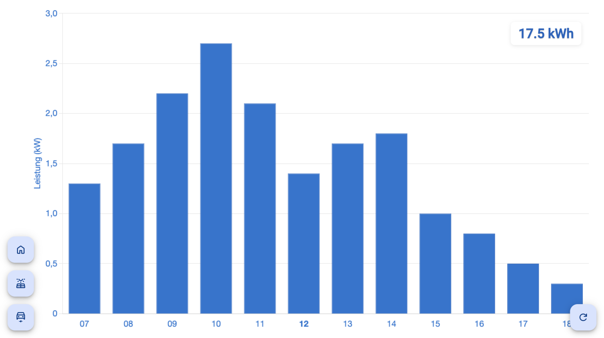

# Hiko

A full-stack monorepo application for PV forecasts and monitoring wallbox/charging station data.
Built with Angular 20, Express, and TypeScript in an Nx workspace.

It uses the meteoblue API to fetch a PV forecast for the day.

